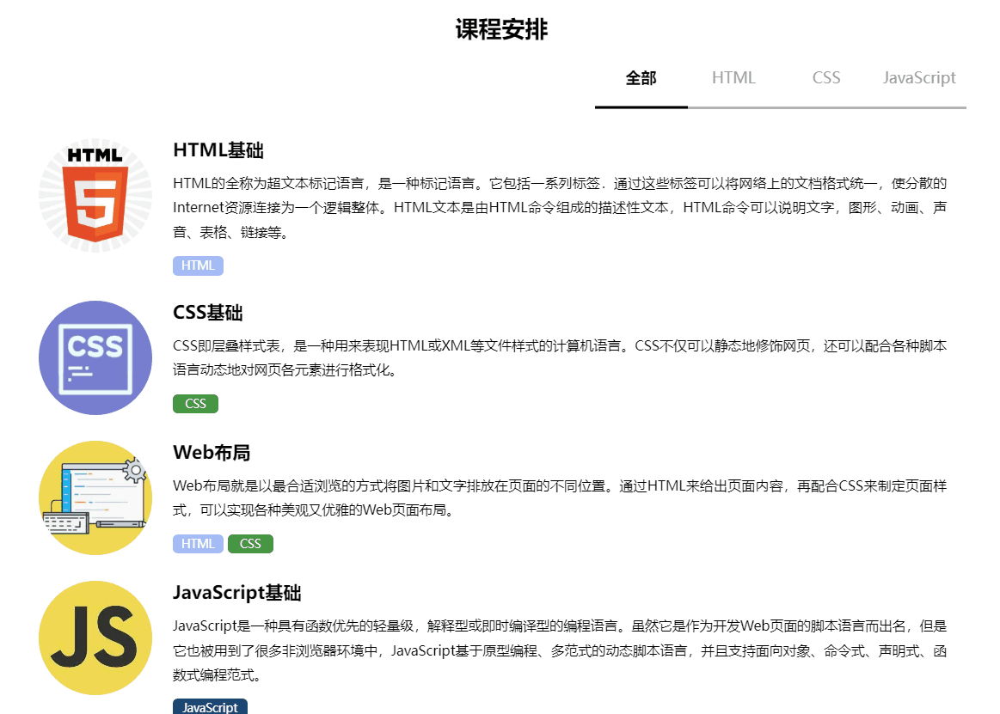
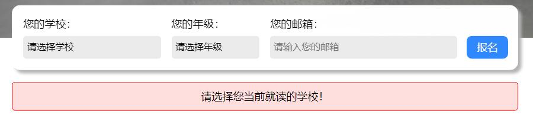
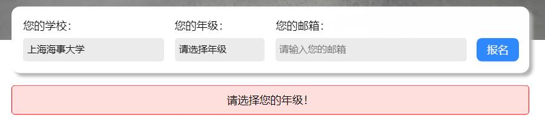
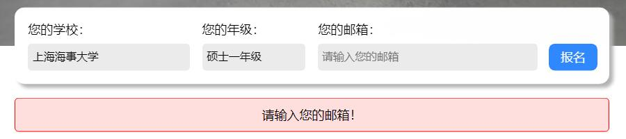
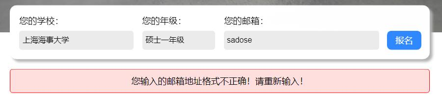
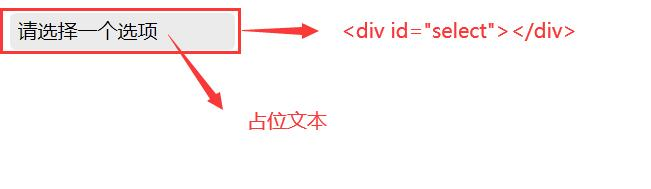
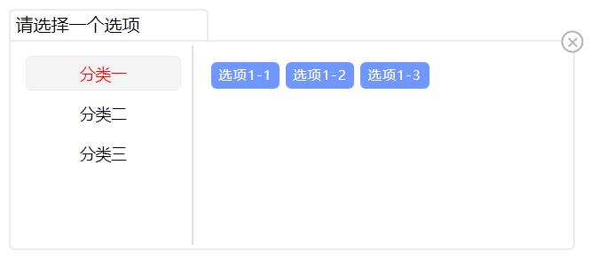
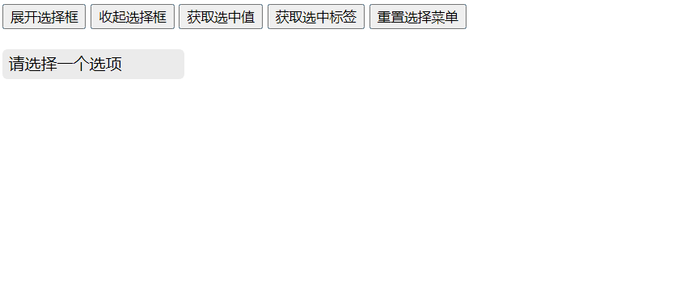

# 工作内容

## 工作内容概述

- [x] 页面和布局
    - [x] 导航栏
    - [x] 头图
    - [x] 报名表单
    - [x] 页面主要内容
    - [x] 页脚
- [x] 报名表单
    - [x] 数据准备
    - [x] 二级级联选择菜单组件的封装
    - [x] 表单验证
    - [x] 消息框
- [x] “我们的宗旨”栏目展示
    - [x] 动画
- [x] “课程安排”选项卡
    - [x] 动画
- [x] 其他
    - [x] 页面内容进入动画
    - [x] “返回顶部”按钮

## 文件目录

``` txt
──┬───┬─ static - 静态资源文件夹
  │   ├───┬─ css - CSS文件目录
  │   │   ├───── selector.css - 二级级联选择菜单的CSS样式
  │   │   └───── style.css - 页面CSS文件
  │   ├───┬─ img - 图片资源目录
  │   │   └───── courses - 课程封面图片目录
  │   ├───┬─ js - Javascript源文件目录
  │   │   ├───── events.js - 页面事件相关
  │   │   ├───── load_data.js - 页面数据加载相关
  │   │   ├───── scroll.js - 页面内容进入动画相关
  │   │   ├───── selector.js - 封装的二级级联选择菜单
  │   │   └───── tab.js - 选项卡切换相关
  │   └───┬─ json - 数据文件目录
  │       ├───── courses.json - 课程数据文件
  │       └───── schools.json - 全国高校数据文件
  ├───── index.html - 主页
  └───── introduction.md - 介绍文档
```


# 快速开始

- 本地预览：将仓库 clone 到本地，在根目录下运行静态页面服务。可使用 VSCode 的 live server 插件，或使用 npm 安装 live-server 工具。

- 在线预览：[http://www.dasenbuling.cn/baidu/last/](http://www.dasenbuling.cn/baidu/last/)


# 动画

## 页面内容进入动画

### 原理与实现

类似于图片懒加载的原理，在页面元素进入视口时，为其添加进入动画。

实现步骤：

1. 为所有需要添加动画的页面元素设置类名`hidden`，通过CSS使它们初始为`opacity: 0;`。

2. 为窗口绑定`load`事件，在窗口加载完毕时执行以下过程：

    - 通过`document.getElementsByClassName("hidden")`获取所有需要添加进入动画的页面元素DOM。
    - 定义懒加载函数并绑定到窗口的`scroll`事件上，使得在每次滚屏时依次判断所有的具有`hidden`类名的页面元素是否进入视口，为进入视口的元素移除`hidden`类名，并添加`animated``fadeInUp`类名。

3. `animated`和`fadeInUp`类名通过CSS定义了进入动画。

### 主要代码

`animated`和`fadeInUp`类名定义的CSS动画：

``` css
:root {
    --animate-duration: 800ms;
    --animate-delay: 1s;
    --animate-repeat: 1;
}
.animated {
    -webkit-animation-duration: var(--animate-duration);
    animation-duration: var(--animate-duration);
    -webkit-animation-fill-mode: both;
    animation-fill-mode: both;
}
.fadeInUp {
    -webkit-animation-name: fadeInUp;
    animation-name: fadeInUp;
}
@-webkit-keyframes fadeInUp {
    0% {
        opacity: 0;
        -webkit-transform: translate3d(0, 100%, 0);
        transform: translate3d(0, 100%, 0);
    }

    to {
        opacity: 1;
        -webkit-transform: translateZ(0);
        transform: translateZ(0);
    }
}
@keyframes fadeInUp {
    0% {
        opacity: 0;
        -webkit-transform: translate3d(0, 100%, 0);
        transform: translate3d(0, 100%, 0);
    }

    to {
        opacity: 1;
        -webkit-transform: translateZ(0);
        transform: translateZ(0);
    }
}
```

懒加载原理实现的动态添加进入动画：

``` js
// 懒加载原理
function lazyload(doms) {
    // 可视区域高度
    let viewHeight = window.innerHeight;
    // 滚动区域高度
    let scrollHeight = document.documentElement.scrollTop || document.body.scrollTop;
    // 遍历 DOM
    for (let i = 0; i < doms.length; i++) {
        if (viewHeight + scrollHeight > getTop(doms[i])) {
            // 延迟 0.5s 加载
            setTimeout(function () {
                if (doms[i]) {
                    doms[i].classList.add("animated", "fadeInUp");
                    doms[i].classList.remove("hidden");
                    lazyload(hiddenDoms);
                }
            }, 500);
            return;
        }
    }
}
```

### 效果


## “我们的宗旨”栏目介绍展示动画

### 原理与实现

通过在图片的上方使用一个绝对定位的标签来实现，该标签覆盖在图片的上方，宽度为图片的100%，但初始设置`padding-top: calc(100% + 20px);`（由于图片为宽高比1:1，因此宽度的100%也为高度的100%），即使用`padding-top`来将文字挤出容器标签的区域，并对容器标签设置`overflow: hidden;`来隐藏超出的部分。

当鼠标移动到标签上时，改变其`padding-top`和`background-color`，利用`transition`来实现补间动画。

### 主要代码

``` css
.hover-img {
    position: relative;
    overflow: hidden;
}
.hover-text {
    position: absolute;
    top: 0; left: 0; right: 0;
    height: 100%;
    /* …… 省略关于字体的部分 */
    padding-top: calc(100% + 20px);
    padding-left: 20px;
    padding-right: 20px;
    transition: all 300ms linear;
}
.hover-text:hover {
    padding-top: 20px;
    background-color: rgb(0, 0, 0, 60%);
}
```

### 效果


## “课程安排”选项卡切换动画

### 原理与实现

所有的选项卡都绝对定位在容器中，为它们设置`active`、`left`和`right`三种类名，分别代表了当前展示的选项卡、在其左侧的选项卡和在其右侧的选项卡，当点击选项卡标题切换选项卡时，对相应的选项卡进行类名调整。

三种类名分别对应了三种`transform`值和`opacity`值，并使用`transition`来实现补间动画：
- `left`：`transform: translateX(-100%);` `opacity: 0;`
- `active`：`transform: translateX(0);` `opacity: 0;`
- `right`：`transform: translateX(100%);` `opacity: 0;`

这样具有`left`类名的选项卡被移出可视区域左边，`right`类名的选项卡被移出到右边，同时它们为全透明，只有`active`的选项卡在可视区域里且为不透明状态，配合补间动画即可实现滑动切换效果。

此外为了实现选项卡标题下划线也随着选项卡切换而滑动，选用一个高为`2px`的`div`来作为下划线容器，其背景色设置为灰色，其内嵌套一个黑色的、宽度为单个选项卡标题宽度的`div`作为滑块，通过JS控制类名来改变其`margin-left`的值配合`transition`补间动画来实现滑动。

### 主要代码

由于逻辑和原理简单，但DOM操作复杂，代码篇幅较长，故省略。

### 效果




# 报名表单

## 数据准备

全国高校数据使用了[来自GitHub的数据](https://github.com/WenryXu/ChinaUniversity/blob/master/ChinaUniversityList.json)，并在此基础上使用Python进行清洗和整理，将其中不必要的信息去掉，同时只保留公立本科层次的高校，并将数据保存为如 `{ "省份": [该省高校的名称数组], ... }` 格式的Json文件。

课程数据则是参考百度技术培训中心的前端学习路线的基础课程然后~~自己编的~~整理而成。

## 二级级联选择菜单组件

### 简介

报名表单由两个级联选择菜单（分别用来选择学校和年级）、一个输入框（输入报名邮箱）和一个提交按钮组成。

因此出于代码复用的思想对“二级级联选择菜单组件”进行封装，最终封装为一个JS文件和一个CSS文件，在使用时只需实例化同时为其传入不同的数据并挂在在两个页面DOM上即可实现两个级联选择器。

### 封装内容

`selector.css`文件封装了所有在组件中用到的样式。

`selector.js`则封装了所有代码逻辑，它包含两个类：`SelectorDasen`类和`Selector`类。

`SelectorDasen`类拥有以下成员属性和方法：
- `constructor(root, data, placeholder, size)`：构造函数。`root`为要挂载到页面的元素的ID属性；`data`为数据对象，其中包含了所有的一级和二级选项；`placeholder`为还未有选项选中时的占位提示文本；`size`值可以为`"small"`、`"middle"`或`"big"`，来定制选择框的大小。其中`placeholder`默认为`"请选择"`，`size`默认为`"middle"`，它们的值可省略。
- `documentRootId`：保存了要挂载的页面元素的ID。
- `selectorRoot`：保存了整个选择菜单组件根标签元素的DOM，在构造函数中通过`document.createElement("div")`创建。
- `placeholder`：保存了选择菜单初始的占位符，默认为`"请选择"`。
- `selectedLabel`：保存了选择菜单用来显示选择结果的`Label`元素的页面元素DOM，在构造函数中通过`document.createElement("div")`创建。
- `selectorOptions`：保存了需要进行展开、收起操作的选择框的页面元素DOM，在构造函数中通过`document.createElement("div")`创建。
- `supItems`：保存所有一级选项的数组。
- `subItems`：保存所有二级选项的数组。
- `lastSupItemId`：保存了上次被选中的一级选项的唯一ID。
- `lastSubItemId`：保存了上次被选中的二级选项的唯一ID。
- `selectedId`：保存了当前选择内容的唯一ID。
- `selectedValue`：保存了当前选择内容的值。
- `select()`：私有方法，将某个选项置为选中状态。
- `resetScroll()`：私有方法，调整选择框的滚动条使选中的选项在可见区域内。
- `open()`：**公有方法**，展开选择框。
- `close()`：**公有方法**，收起选择框。
- `getValue()`：**公有方法**，获取当前被选中的值。
- `getTag()`：**公有方法**，获取当前被选中的值对应的一级选项。
- `reset()`：**公有方法**，清除已选中的值，并重置组件状态。
- `SelectorDasen.tagClick()`：静态私有方法，一级选项的点击事件，切换选择框中的二级选项区域。
- `SelectorDasen.switchActive()`：静态私有方法，接收一个或两个DOM作为参数，切换它们的`active`类名。

可以看到该类中的公有方法只有`open()`、`close()`、`getValue()`、`getTag()`、`reset()`这五个，因此出于安全性考虑，应当只将它们暴露给使用者，并屏蔽掉其他方法和属性，同时禁止对组件对象实例的属性和方法进行修改。因此使用了**代理类**`Selector`提供给使用者进行实例化。

`Selector`类只拥有一个与`SelectorDasen`类签名相同的构造函数，无其他的方法和属性。通过实例化`Selector`类，它将会在构造函数中实例化`SelectorDasen`类，并为该实例创建带有`get`和`set`拦截器的代理。在`get`拦截器中拦截所有对除了上述五个公有方法以外的属性和方法的访问，访问均返回`undefined`；在`set`拦截器中拦截所有的修改操作，使对象变为只读的。

### 使用

使用组件时，只需将`Selector`类实例化并传入相应参数，即可将级联选择菜单挂载到页面上的相应DOM上。在本项目中使用如下：

``` js
let schoolSelector = null;
let gradeSelector = null;
(async () => {
    const res = await fetch("static/json/schools.json");
    const data = await res.json();
    schoolSelector = new Selector("school-select", data, "请选择学校");
    gradeSelector = new Selector("grade-select", {
        "本科": ["本科一年级", "本科二年级", "本科三年级", "本科四年级", "本科五年级", "其他"],
        "硕士": ["硕士一年级", "硕士二年级", "硕士三年级", "其他"],
        "博士": ["博士一年级", "博士二年级", "博士三年级", "其他"],
        "其他": ["其他"]
    }, "请选择年级", "small");
})();
```

这样即可把学校选择菜单挂载到页面上ID为`"school-select"`的标签上，而年级选择菜单被挂载到ID为`"grade-select"`的标签上。

## 表单验证

### 规则

表单验证的规则为：
- 必须要选择就读的学校；
- 必须要选择就读的年级；
- 必须要填入一个合法的报名邮箱。

### 验证

学校和年级通过封装的级联选择菜单组件来选择，在选择菜单组件中实现了获取当前选择值的方法`getValue()`，在未选择选项时取得的选择值为空字符串，因此只需判断`selector.getValue()`返回值是否为空，就可验证用户是否选择了选项。

对于邮箱地址，首先判断是否未填写，其次通过以下正则表达式来判断其合法性：

``` js
/^(([^<>()[\]\\.,;:\s@"]+(\.[^<>()[\]\\.,;:\s@"]+)*)|(".+"))@((\[[0-9]{1,3}\.[0-9]{1,3}\.[0-9]{1,3}\.[0-9]{1,3}\])|(([a-zA-Z\-0-9]+\.)+[a-zA-Z]{2,}))$/
```

### 提示消息

通过在页面上显示一个消息框来提示表单验证的结果或报名成功的消息，使用JS为其指定自定义属性`data-type`为`"error"`或`"success"`或空字符串`""`来控制其显示和样式，同时通过其`innerText`属性来设置其内容。CSS样式如下：

``` css
#msg-box {
    display: none;
}
#msg-box[data-type="error"],
#msg-box[data-type="success"] {
    display: block;
    box-sizing: border-box;
    border: transparent solid 1px;
    border-radius: 5px;
    padding: 10px;
    margin-top: 10px;
    text-align: center;
}
#msg-box[data-type="error"] {
    border-color: red;
    background-color: rgb(255, 222, 222);
}
#msg-box[data-type="success"] {
    border-color: green;
    background-color: rgb(222, 255, 222);
}
```

此外，消息框的显示被封装为了一个函数，函数接受三个参数：提示文本、消息框类型（错误提示或成功提示）以及显示时间。显示时间将提供在显示消息框之后自动关闭消息框的秒数。

消息框如下：







# 二级级联选择菜单组件

## 引入

二级级联选择菜单组件包含`selector.css`和`selector.js`两个文件，分别通过

``` html
<link rel="stylesheet" href="static/css/selector.css">
```

和

``` html
<script src="static/js/selector.js"></script>
```

在页面中引入它们即可使用。

## 接口与方法

### 实例化

通过new操作符可实例化一个级联选择菜单组件并挂载到对应的页面DOM中：

``` js
const selector = new Selector("select", {
        "分类一": ["选项1-1", "选项1-2", "选项1-3"],
        "分类二": ["选项2-1", "选项2-2", "选项2-3"],
        "分类三": ["选项3-1", "选项3-2", "选项3-3"]
    }, "请选择一个选项", "small");
```

该构造函数接收四个参数：
- `root`：`String`，级联选择菜单组件需要挂载到页面上的元素的ID属性。
- `data`：`Object`，生成二级级联菜单内容的数据对象，格式如 `{ "一级选项": [对应的二级选项数组], ... }` 。
- `placeholder`：`String`，可选，还未有选项选中时的占位提示文本，默认为`"请选择"`。
- `size`：`"small" | "middle" | "big"`，可选，定制选择框的大小，默认为`"middle"`。

如上例即可实现将选项生成尺寸为`"small"`的二级级联菜单，并挂载到ID为`"select"`的页面DOM上，在用户未选择选项时的占位提示文本为`"请选择一个选项"`。如下图所示：




### 公有方法

可在对象实例上调用如下方法来展开和收起选择框：
- `open()`：展开选择框。
- `close()`：收起选择框。

可通过调用实例对象上的以下方法来获取选择的值（一级选项或二级选项）：
- `getValue()`：获取当前被选中的值（二级选项）。
- `getTag()`：获取当前被选中的值对应的标签（一级选项）。

如用户当前选择的选项是`"河南省"`下的`"郑州市"`，那么：

``` js
selector.getValue(); // "郑州市"
selector.getTag(); // "河南省"
```

可通过调用实例上的`reset()`方法来清除用户选择的值，并重置组件为初始状态：
- `reset()`：清除已选中的值，并重置组件状态。

### 最佳实践

有如下例子：

``` html
<link rel="stylesheet" href="static/css/selector.css">
<script src="static/js/selector.js"></script>

<style>
    #select {
        width: 180px;
        height: 30px;
        margin-top: 20px;
    }
</style>

<button onclick="selector.open()">展开选择框</button>
<button onclick="selector.close()">收起选择框</button>
<button onclick="alert(selector.getValue())">获取选中值</button>
<button onclick="alert(selector.getTag())">获取选中标签</button>
<button onclick="selector.reset()">重置选择菜单</button>
<div id="select"></div>

<script>
    const selector = new Selector("select", {
        "分类一": ["选项1-1", "选项1-2", "选项1-3"],
        "分类二": ["选项2-1", "选项2-2", "选项2-3"],
        "分类三": ["选项3-1", "选项3-2", "选项3-3"]
    }, "请选择一个选项", "small");
</script>
```

效果：




# 总结展望

1. 兼容性：由于使用原生JS实现，因此出于各种原因并未能完全考虑到在所有游览器中的表现一致性和稳定性，未做兼容性处理。
2. 移动端：未做移动端的适配，仅做了简单的媒体查询，使其能在不同分辨率的（电脑）屏幕上表现正常。
